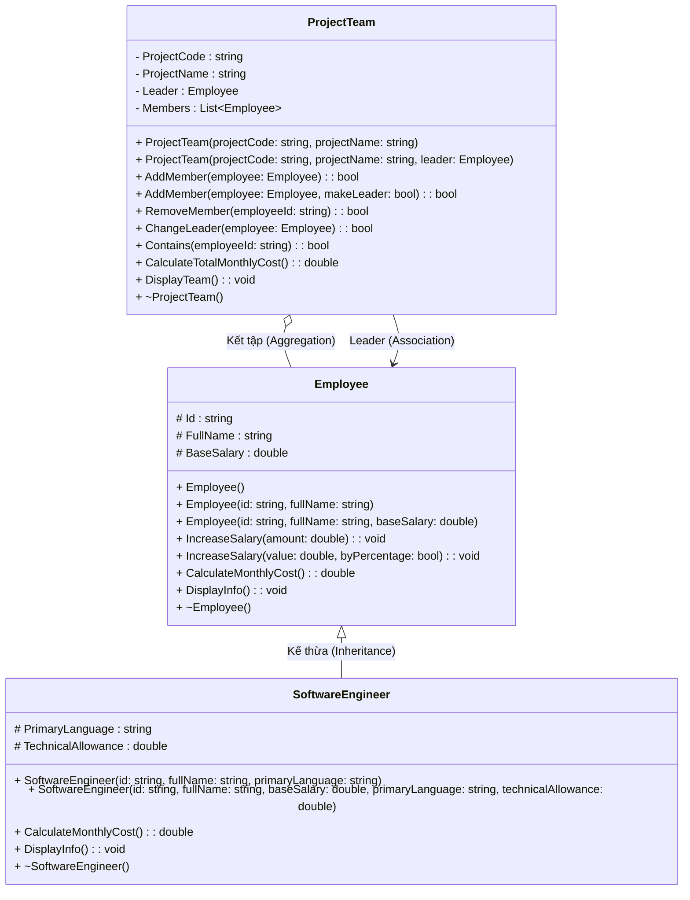

# Báo Cáo Thực Hành Lab 03-04: Đa Hình và Kết Tập (C#)

**Mã sinh viên:** 202418834
**Họ tên:** Trần Tuấn Anh

## 1. Link Github

## 2. Sơ đồ thiết kế (Class Diagram)

## 3. Hình ảnh chạy thử chương trình

